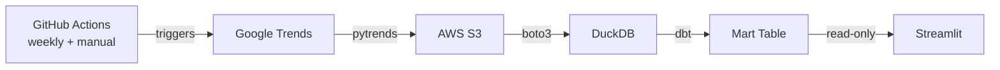
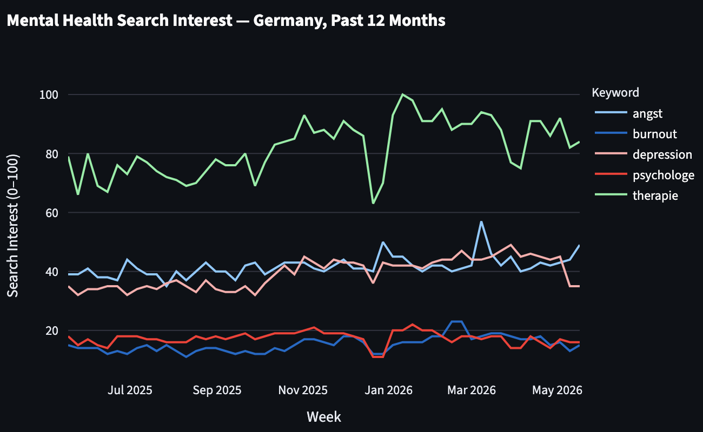
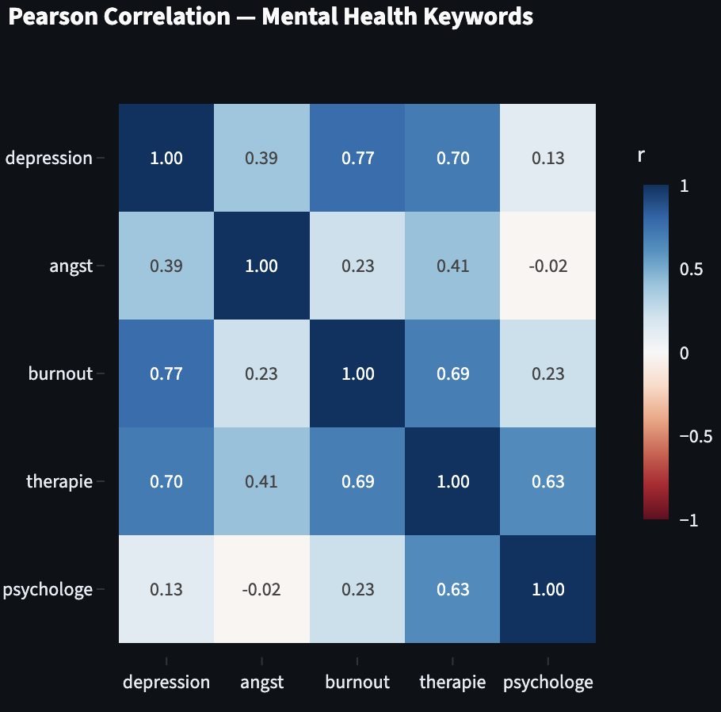

# undercurrent

A near real time mental health signals platform for Germany. It ingests weekly Google Trends search data, transforms it through a dbt pipeline, and surfaces keyword trends and correlations through an interactive Streamlit dashboard.

**Live demo:** coming soon

---

## The Problem

Mental health burden in Germany is substantial and growing, but the data that could inform responses is slow. Clinical registries and statutory health statistics typically lag reality by 12 to 24 months. By the time a policymaker sees a surge in depression diagnoses, the peak has already passed and the window for early intervention is gone.

For individuals, the challenge is different. Mental health struggles can feel uniquely personal. Knowing that search interest in *Burnout* is rising nationally, or that it moves in lockstep with *Depression*, contextualises individual experience and can reduce the sense of isolation.

Undercurrent uses weekly Google Trends search data as a near real time proxy. Not a clinical measurement, but a directionally accurate signal that updates every Monday rather than every two years.

---

## Who Benefits

- **Policymakers** — spot surging trends months before clinical data arrives, enabling earlier resource allocation
- **NGOs and health organisations** — identify which conditions need urgent campaign focus
- **Health insurers** — anticipate demand spikes and plan capacity accordingly
- **Researchers** — access a reproducible, continuously updated signal dataset
- **Individuals** — contextualise personal mental health experience against national patterns

---

## Architecture

Each Monday at 06:00 UTC, GitHub Actions runs the ingestion pipeline. The script fetches weekly search interest from Google Trends via pytrends and uploads a dated CSV to a versioned, encrypted S3 bucket. A loader script pulls the latest snapshot into a local DuckDB file, and dbt transforms the raw data into a clean mart table that Streamlit queries directly.

AWS access follows least-privilege principles. The ingestor runs under a dedicated IAM role scoped to S3 only, assumed at runtime via STS AssumeRole. Credentials are stored as GitHub Secrets and never written to disk. Infrastructure is fully defined in Terraform.

---

## Dashboard

*Weekly search interest (0 to 100, relative scale) for five German mental health keywords. The multiselect filter lets you isolate individual keywords.*

*Pearson correlation matrix across the five keywords. Values close to 1 indicate the two keywords rise and fall together across the same weeks.*

---

## Key Findings

- **Depression and burnout move in lockstep.** With a Pearson correlation of r = 0.84, the two keywords track each other closely across every week in the dataset.
- **Angst follows a completely different pattern.** It is weakly correlated with all other keywords (r = 0.09 to 0.37), suggesting it is driven by distinct seasonal or news-cycle effects rather than general mental health burden.
- **All five keywords are positively correlated.** No inverse relationships exist in the dataset, which is expected for terms that all relate to mental health.
- **Search interest is relative, not absolute.** Google scales each keyword so its peak week equals 100. A value of 50 means half as many searches as the peak, not 50 searches.

---

## Limitations

- **pytrends is unofficial.** It reverse-engineers the Google Trends web interface rather than calling a documented API. Breaking changes from Google can disrupt ingestion without warning.
- **Search interest is not prevalence.** Higher search volume for a term may reflect growing awareness, media coverage, or stigma reduction rather than increased incidence of the condition itself.
- **The 0 to 100 scale is relative per query.** Each ingestion run rescales all values relative to the peak week in that snapshot. The numbers are not comparable across independent queries.
- **Five keywords is a limited signal.** The current keyword set covers formal clinical terms and may miss colloquial language or emerging topics.
- **German language searches only.** The data does not capture mental health searches from non-German-speaking residents of Germany.
- **Phase 1 scope.** Only Google Trends data is ingested. Reddit, RKI open data, and Spotify signals are planned for later phases.

---

## Roadmap

- Additional data sources: Reddit community sentiment, RKI open health data, Spotify listening patterns
- Production data warehouse: Redshift Serverless replacing the local DuckDB file
- Orchestration: Apache Airflow managing the full pipeline
- AI layer: LangGraph agent for natural language querying grounded in the data
- Backend API: FastAPI exposing the mart data programmatically
- Public deployment: Streamlit Community Cloud
